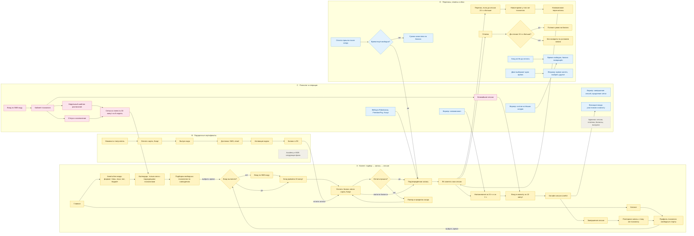

# Карта путей: клиент, психолог, операции

Жёлтый — клиент, розовый — психолог, голубой — система и операции, серый пунктир — следующая фаза.

```mermaid
flowchart LR
  subgraph A["A · Клиент: подбор → запись → сессия"]
    direction LR
    A1["Главная"] --> A2["Анкета без входа: формат, темы, язык, пол, бюджет"]
    A2 --> A3["Календарь: только окна с подходящими психологами"]
    A3 --> A4["Подборка свободных психологов по совпадению"]
    A1 --> A5["Каталог"] --> A6["Профиль психолога: свободные старты"]
    A4 -->|"выбрать время"| A8{"Вход выполнен?"}
    A6 -->|"выбрать время"| A8
    A8 -->|"нет"| A9["Вход по SMS-коду"] --> A7["Холд времени 15 минут"]
    A8 -->|"да"| A7
    A7 --> A10["Оплата: баланс и/или карта, Kaspi"]
    A10 --> A11{"Оплата прошла?"}
    A11 -->|"да"| A12["Подтверждённая запись"]
    A11 -->|"нет"| A13["Повтор в пределах холда"] --> A10
    A10 -->|"хватило баланса"| A12
    A12 --> A14["ЛК клиента: мои сессии"]
    A14 --> A15["Напоминания за 24 ч и за 1 ч"]
    A15 --> A16["Вход в комнату за 10 минут"]
    A16 --> A17["Онлайн-сессия LiveKit"]
    A17 --> A18["Завершение сессии"]
    A18 --> A19["Повторная запись к тому же психологу"] --> A6
  end

  subgraph B["B · Подарочные сертификаты"]
    direction LR
    B1["Номинал и получатель"] --> B2["Оплата: карта, Kaspi"]
    B2 --> B3["Выпуск кода"] --> B4["Доставка: SMS, email"]
    B4 --> B5["Активация кодом"] --> B6["Баланс в ЛК"]
    B7["Academy и B2B: следующая фаза"]
  end
  B6 -->|"оплата записи"| A10

  subgraph C["C · Психолог и операции"]
    direction LR
    C1["Вход по SMS-коду"] --> C2["Кабинет психолога"]
    C2 --> C3["Недельный шаблон расписания"]
    C2 --> C4["Отпуск и исключения"]
    C3 --> C5["Сетка из ячеек по 30 минут на 8 недель"]
    C4 --> C5
    C2 --> C6["Ближайшие сессии"]
    O1["Вебхуки Robokassa, FreedomPay, Kaspi"]
    O2["Воркер: снятие истёкших холдов"]
    O3["Воркер: напоминания"]
    O4["Воркер: завершение сессий, продление сетки"]
    O5["Фиксация входа участников в комнату"]
    O6["Админка: сессии, платежи, балансы, выгрузки"]
  end
  C5 --> A3
  C6 --> A16
  O1 --> A12
  O3 --> A15
  A17 --> O5

  subgraph D["D · Переносы, отмены и сбои"]
    direction LR
    D1["Перенос, если до сессии 24 ч и больше"] --> D2["Новое время у того же психолога"] --> D3["Напоминания пересчитаны"]
    D4["Отмена"] --> D5{"До сессии 24 ч и больше?"}
    D5 -->|"да"| D6["Полная сумма на баланс"]
    D5 -->|"нет"| D7["Без возврата по условиям заказа"]
    D8["Холд истёк до оплаты"] --> D9["Время свободно, баланс возвращён"]
    D10["Оплата пришла после холда"] --> D11{"Время ещё свободно?"}
    D11 -->|"нет"| D12["Сумма зачислена на баланс"]
    D13["Двое выбирают одно время"] --> D14["Второму: время занято, выбрать другое"]
  end
  A14 --> D1
  A14 --> D4
  D11 -->|"да"| A12
  D3 --> A14
  O2 --> D9

  classDef client fill:#FFF4C2,stroke:#D9A400,color:#3D2E00
  classDef psy fill:#FCE4EC,stroke:#D4537E,color:#4B1528
  classDef ops fill:#E3F2FD,stroke:#378ADD,color:#0C447C
  classDef later fill:#F1EFE8,stroke:#888780,color:#444441,stroke-dasharray: 5 5

  class A1,A2,A3,A4,A5,A6,A7,A8,A9,A10,A11,A12,A13,A14,A15,A16,A17,A18,A19 client
  class B1,B2,B3,B4,B5,B6 client
  class D1,D2,D3,D4,D5,D6,D7 client
  class C1,C2,C3,C4,C5,C6 psy
  class O1,O2,O3,O4,O5,D8,D9,D10,D11,D12,D13,D14 ops
  class B7,O6 later
```
